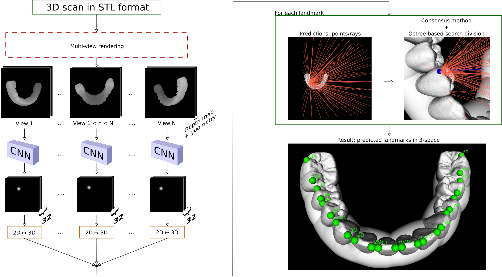

## Welcome to GitHub Page for the project I've created as my Bachelor's Thesis and later presented at [BIOIMAGING '22 conference](https://http://www.bioimaging.biostec.org/).

The primary objective of this page is to present summary of the paper as well as to hold all the necessary links at one place (code, testing dataset, ...).

### Method Summary
Our method aims to bring automation in the process of orthodontics treatment. Some facts that stem from this:
  - We are dealing with difficult cases of orthodontics patients, i.e. the input meshes are obtained by scanning the dental arches of unhealthy patients with various kinds of teeth misplacements, shiftings, etc. 
  - It should not rely on *strong* PCs with modern GPUs - it should run on *normal* consumer computer (imagine for example the computer of your clinitian) in seconds.
 
#### Outline

 To meet the aforementioned needs, the learning task is to regress heatmaps of Gaussians in 2D. Afterward, using multiple viewpoints, the result postion is calculated from valid viewpoints only -- incorrect ones are eliminated using RANSAC and least-squares fit.
 
### Overall Results
On a testing dataset of complicated orthodontic cases, we report the landmarking accuracy of **0.75 +- 0.96 mm**. As for the missing teeth, our method detects correctly the presence of teeth in **97.68%** cases. These results are achieved using Attention U-Net, 100 viewpoints and RANSAC post-processing.

### Available Testing Dataset
Unfortunately, we are not allowed to share the whole dataset which we've used for the training, validation, and testing. However, to compare are results with other frameworks for orthodontic landmark detection, we are sharing a portion of the test set. You can download 20 meshes for the testing here: [tbd](https://tbd).

#### Results on the Public Testing Subset
For a fair comparison, we've measured the landmarking accuracy and teeth detection accuracy solely on the public portion of the test set. Among all the test cases, we've tried to share the challenging ones. Our method achieves following results: **tbd**. 

### Contact
Do not hesitate to ask in case you have any questions -- my LinkedIn profile: [click](https://www.linkedin.com/in/tibor-kub%C3%ADk-7a4364181/) or write me an email: [click](mailto:xkubik34@stud.fit.vutbr.cz).

### Special Thanks
Special thanks goes to Michal Španěl, the best supervisor, and to [TESCAN 3DIM, s.r.o.](https://www.linkedin.com/company/tescan-3dim/) for providing the dataset and funding.
